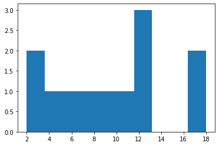
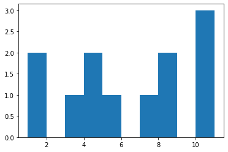

```python
import pandas as pd
```


```python
dataset=pd.read_excel("Correlation.xlsx",sheet_name=1)
```


```python
dataset.head()
```


<div>
<style scoped>
    .dataframe tbody tr th:only-of-type {
        vertical-align: middle;
    }

    .dataframe tbody tr th {
        vertical-align: top;
    }

    .dataframe thead th {
        text-align: right;
    }
</style>
<table border="1" class="dataframe">
  <thead>
    <tr style="text-align: right;">
      <th></th>
      <th>Respondent Number</th>
      <th>Attitude</th>
      <th>Duration</th>
      <th>Importance</th>
    </tr>
  </thead>
  <tbody>
    <tr>
      <th>0</th>
      <td>1</td>
      <td>6</td>
      <td>10</td>
      <td>3</td>
    </tr>
    <tr>
      <th>1</th>
      <td>2</td>
      <td>9</td>
      <td>12</td>
      <td>11</td>
    </tr>
    <tr>
      <th>2</th>
      <td>3</td>
      <td>8</td>
      <td>12</td>
      <td>4</td>
    </tr>
    <tr>
      <th>3</th>
      <td>4</td>
      <td>3</td>
      <td>4</td>
      <td>1</td>
    </tr>
    <tr>
      <th>4</th>
      <td>5</td>
      <td>10</td>
      <td>12</td>
      <td>11</td>
    </tr>
  </tbody>
</table>
</div>


# SIMPLE REGRESSION
# one dependent and one independent


```python
#simple regression btw duration and attitude
#where duration is independent var and attitude is dependent var
#to check whether duration affects the attitude or not
```


```python
#Simple predective analysis
```


```python
import statsmodels.api as sm
```


```python
Y=dataset.Attitude
```


```python
X=dataset.Duration
```


```python
X1=sm.add_constant(X)
X1
```


<div>
<style scoped>
    .dataframe tbody tr th:only-of-type {
        vertical-align: middle;
    }

    .dataframe tbody tr th {
        vertical-align: top;
    }

    .dataframe thead th {
        text-align: right;
    }
</style>
<table border="1" class="dataframe">
  <thead>
    <tr style="text-align: right;">
      <th></th>
      <th>const</th>
      <th>Importance</th>
    </tr>
  </thead>
  <tbody>
    <tr>
      <th>0</th>
      <td>1.0</td>
      <td>3</td>
    </tr>
    <tr>
      <th>1</th>
      <td>1.0</td>
      <td>11</td>
    </tr>
    <tr>
      <th>2</th>
      <td>1.0</td>
      <td>4</td>
    </tr>
    <tr>
      <th>3</th>
      <td>1.0</td>
      <td>1</td>
    </tr>
    <tr>
      <th>4</th>
      <td>1.0</td>
      <td>11</td>
    </tr>
    <tr>
      <th>5</th>
      <td>1.0</td>
      <td>1</td>
    </tr>
    <tr>
      <th>6</th>
      <td>1.0</td>
      <td>7</td>
    </tr>
    <tr>
      <th>7</th>
      <td>1.0</td>
      <td>4</td>
    </tr>
    <tr>
      <th>8</th>
      <td>1.0</td>
      <td>8</td>
    </tr>
    <tr>
      <th>9</th>
      <td>1.0</td>
      <td>10</td>
    </tr>
    <tr>
      <th>10</th>
      <td>1.0</td>
      <td>8</td>
    </tr>
    <tr>
      <th>11</th>
      <td>1.0</td>
      <td>5</td>
    </tr>
  </tbody>
</table>
</div>


```python
simple=sm.OLS(Y,X1)  #ols is func for predecitive analysis

```


```python
result=simple.fit()
```


```python
result.summary()
```

    C:\Users\Kulsum\AppData\Roaming\Python\Python38\site-packages\scipy\stats\stats.py:1603: UserWarning: kurtosistest only valid for n>=20 ... continuing anyway, n=12
      warnings.warn("kurtosistest only valid for n>=20 ... continuing "
    


<table class="simpletable">
<caption>OLS Regression Results</caption>
<tr>
  <th>Dep. Variable:</th>        <td>Attitude</td>     <th>  R-squared:         </th> <td>   0.876</td>
</tr>
<tr>
  <th>Model:</th>                   <td>OLS</td>       <th>  Adj. R-squared:    </th> <td>   0.864</td>
</tr>
<tr>
  <th>Method:</th>             <td>Least Squares</td>  <th>  F-statistic:       </th> <td>   70.80</td>
</tr>
<tr>
  <th>Date:</th>             <td>Mon, 08 Feb 2021</td> <th>  Prob (F-statistic):</th> <td>7.55e-06</td>
</tr>
<tr>
  <th>Time:</th>                 <td>21:07:49</td>     <th>  Log-Likelihood:    </th> <td> -18.352</td>
</tr>
<tr>
  <th>No. Observations:</th>      <td>    12</td>      <th>  AIC:               </th> <td>   40.70</td>
</tr>
<tr>
  <th>Df Residuals:</th>          <td>    10</td>      <th>  BIC:               </th> <td>   41.67</td>
</tr>
<tr>
  <th>Df Model:</th>              <td>     1</td>      <th>                     </th>     <td> </td>   
</tr>
<tr>
  <th>Covariance Type:</th>      <td>nonrobust</td>    <th>                     </th>     <td> </td>   
</tr>
</table>
<table class="simpletable">
<tr>
      <td></td>        <th>coef</th>     <th>std err</th>      <th>t</th>      <th>P>|t|</th>  <th>[0.025</th>    <th>0.975]</th>  
</tr>
<tr>
  <th>const</th>    <td>    1.0793</td> <td>    0.743</td> <td>    1.452</td> <td> 0.177</td> <td>   -0.577</td> <td>    2.736</td>
</tr>
<tr>
  <th>Duration</th> <td>    0.5897</td> <td>    0.070</td> <td>    8.414</td> <td> 0.000</td> <td>    0.434</td> <td>    0.746</td>
</tr>
</table>
<table class="simpletable">
<tr>
  <th>Omnibus:</th>       <td> 6.168</td> <th>  Durbin-Watson:     </th> <td>   2.783</td>
</tr>
<tr>
  <th>Prob(Omnibus):</th> <td> 0.046</td> <th>  Jarque-Bera (JB):  </th> <td>   3.282</td>
</tr>
<tr>
  <th>Skew:</th>          <td> 1.271</td> <th>  Prob(JB):          </th> <td>   0.194</td>
</tr>
<tr>
  <th>Kurtosis:</th>      <td> 3.319</td> <th>  Cond. No.          </th> <td>    22.5</td>
</tr>
</table><br/><br/>Warnings:<br/>[1] Standard Errors assume that the covariance matrix of the errors is correctly specified.


RESULT 
step1:check the R2 value=0.876 =>87.6 % duration affects the attitude
step2:framing the equation
->const value=1.0793
->duration  coeff = 0.589
->formula is
->Attitude=1.079 + 0.589 (Duration)
step3=P value if IDV is <0.05 ,then it is significant
->p val=0.000 Hence it is significant
=>which means the duration is significantly affecting the attitude


```python
0.00<0.05
```


    True


```python

```

# Multiple Regression
one dependent and more than one independent var


```python
Y=dataset.Attitude  #dependent
```


```python
X=dataset[['Duration','Importance']]   #independent vars
```


```python
X1=sm.add_constant(X)
```


```python
multiple=sm.OLS(Y,X1)
```


```python
result=multiple.fit()
```


```python
result.summary()
```


<table class="simpletable">
<caption>OLS Regression Results</caption>
<tr>
  <th>Dep. Variable:</th>        <td>Attitude</td>     <th>  R-squared:         </th> <td>   0.945</td>
</tr>
<tr>
  <th>Model:</th>                   <td>OLS</td>       <th>  Adj. R-squared:    </th> <td>   0.933</td>
</tr>
<tr>
  <th>Method:</th>             <td>Least Squares</td>  <th>  F-statistic:       </th> <td>   77.29</td>
</tr>
<tr>
  <th>Date:</th>             <td>Mon, 08 Feb 2021</td> <th>  Prob (F-statistic):</th> <td>2.15e-06</td>
</tr>
<tr>
  <th>Time:</th>                 <td>21:07:50</td>     <th>  Log-Likelihood:    </th> <td> -13.488</td>
</tr>
<tr>
  <th>No. Observations:</th>      <td>    12</td>      <th>  AIC:               </th> <td>   32.98</td>
</tr>
<tr>
  <th>Df Residuals:</th>          <td>     9</td>      <th>  BIC:               </th> <td>   34.43</td>
</tr>
<tr>
  <th>Df Model:</th>              <td>     2</td>      <th>                     </th>     <td> </td>   
</tr>
<tr>
  <th>Covariance Type:</th>      <td>nonrobust</td>    <th>                     </th>     <td> </td>   
</tr>
</table>
<table class="simpletable">
<tr>
       <td></td>         <th>coef</th>     <th>std err</th>      <th>t</th>      <th>P>|t|</th>  <th>[0.025</th>    <th>0.975]</th>  
</tr>
<tr>
  <th>const</th>      <td>    0.3373</td> <td>    0.567</td> <td>    0.595</td> <td> 0.567</td> <td>   -0.946</td> <td>    1.621</td>
</tr>
<tr>
  <th>Duration</th>   <td>    0.4811</td> <td>    0.059</td> <td>    8.160</td> <td> 0.000</td> <td>    0.348</td> <td>    0.614</td>
</tr>
<tr>
  <th>Importance</th> <td>    0.2887</td> <td>    0.086</td> <td>    3.353</td> <td> 0.008</td> <td>    0.094</td> <td>    0.483</td>
</tr>
</table>
<table class="simpletable">
<tr>
  <th>Omnibus:</th>       <td> 0.322</td> <th>  Durbin-Watson:     </th> <td>   1.956</td>
</tr>
<tr>
  <th>Prob(Omnibus):</th> <td> 0.851</td> <th>  Jarque-Bera (JB):  </th> <td>   0.454</td>
</tr>
<tr>
  <th>Skew:</th>          <td> 0.227</td> <th>  Prob(JB):          </th> <td>   0.797</td>
</tr>
<tr>
  <th>Kurtosis:</th>      <td> 2.162</td> <th>  Cond. No.          </th> <td>    28.6</td>
</tr>
</table><br/><br/>Warnings:<br/>[1] Standard Errors assume that the covariance matrix of the errors is correctly specified.


#RESULT
1.R square value increases comapred to simple regression
R square val=0.945 ,94.5%
2.framing the eqn Y=b0+b1(x1)+b2(x2)
                   =constant+coeff.of duration(duration)+coeff.of imp(importance)
                   =0.3373+0.4811(Duration)+0.2887(Importance)
3P val <0.05
duration 0.000<0.05 (it is significant)
importance 0.008<0.05 (it is significant)
both the variables are significantly independent
and compared to importance ,duration is more significant


```python
Y=dataset.Attitude 
X=dataset.Importance
X1=sm.add_constant(X)
simple=sm.OLS(Y,X1)
result=simple.fit()
result.summary()
```


<table class="simpletable">
<caption>OLS Regression Results</caption>
<tr>
  <th>Dep. Variable:</th>        <td>Attitude</td>     <th>  R-squared:         </th> <td>   0.538</td>
</tr>
<tr>
  <th>Model:</th>                   <td>OLS</td>       <th>  Adj. R-squared:    </th> <td>   0.492</td>
</tr>
<tr>
  <th>Method:</th>             <td>Least Squares</td>  <th>  F-statistic:       </th> <td>   11.64</td>
</tr>
<tr>
  <th>Date:</th>             <td>Mon, 08 Feb 2021</td> <th>  Prob (F-statistic):</th>  <td>0.00664</td>
</tr>
<tr>
  <th>Time:</th>                 <td>21:07:50</td>     <th>  Log-Likelihood:    </th> <td> -26.256</td>
</tr>
<tr>
  <th>No. Observations:</th>      <td>    12</td>      <th>  AIC:               </th> <td>   56.51</td>
</tr>
<tr>
  <th>Df Residuals:</th>          <td>    10</td>      <th>  BIC:               </th> <td>   57.48</td>
</tr>
<tr>
  <th>Df Model:</th>              <td>     1</td>      <th>                     </th>     <td> </td>   
</tr>
<tr>
  <th>Covariance Type:</th>      <td>nonrobust</td>    <th>                     </th>     <td> </td>   
</tr>
</table>
<table class="simpletable">
<tr>
       <td></td>         <th>coef</th>     <th>std err</th>      <th>t</th>      <th>P>|t|</th>  <th>[0.025</th>    <th>0.975]</th>  
</tr>
<tr>
  <th>const</th>      <td>    2.4793</td> <td>    1.383</td> <td>    1.793</td> <td> 0.103</td> <td>   -0.602</td> <td>    5.561</td>
</tr>
<tr>
  <th>Importance</th> <td>    0.6746</td> <td>    0.198</td> <td>    3.412</td> <td> 0.007</td> <td>    0.234</td> <td>    1.115</td>
</tr>
</table>
<table class="simpletable">
<tr>
  <th>Omnibus:</th>       <td> 0.639</td> <th>  Durbin-Watson:     </th> <td>   2.353</td>
</tr>
<tr>
  <th>Prob(Omnibus):</th> <td> 0.726</td> <th>  Jarque-Bera (JB):  </th> <td>   0.621</td>
</tr>
<tr>
  <th>Skew:</th>          <td>-0.284</td> <th>  Prob(JB):          </th> <td>   0.733</td>
</tr>
<tr>
  <th>Kurtosis:</th>      <td> 2.041</td> <th>  Cond. No.          </th> <td>    14.4</td>
</tr>
</table><br/><br/>Warnings:<br/>[1] Standard Errors assume that the covariance matrix of the errors is correctly specified.


```python
#Checking the Assumptions
#1.Hetereoskedasticity
import matplotlib.pyplot as plt
```


```python
plt.hist(dataset.Duration)
```


    (array([2., 1., 1., 1., 1., 1., 3., 0., 0., 2.]),
     array([ 2. ,  3.6,  5.2,  6.8,  8.4, 10. , 11.6, 13.2, 14.8, 16.4, 18. ]),
     <BarContainer object of 10 artists>)





```python
#this is not normally distributed,
```


```python
dataset['Duration'].skew()   #negatively skewed
```


    0.13388241686312002


```python
plt.hist(dataset.Importance)
```


    (array([2., 0., 1., 2., 1., 0., 1., 2., 0., 3.]),
     array([ 1.,  2.,  3.,  4.,  5.,  6.,  7.,  8.,  9., 10., 11.]),
     <BarContainer object of 10 artists>)





```python
dataset['Importance'].skew()  
```


    0.0029441651456371693


```python
#passed in heteroskedasticity 
```


```python
#2.auto corealtion
```


```python
from scipy.stats import pearsonr
```


```python
stats,p=pearsonr(dataset.Duration,dataset.Attitude)
```


```python
print(stats,p)  #both are +vely correlated
```

    0.9360778239640098 7.545161167077732e-06
    


```python
stats,p=pearsonr(dataset.Attitude,dataset.Importance)
```


```python
print(stats,p) #both are +vely correlated
```

    0.733445064631502 0.006635068400326112
    


```python
#3.multi collinear
```


```python
stats,p=pearsonr(dataset.Duration,dataset.Importance)
print(stats,p)     #not highly correlated
```

    0.5495197150644797 0.06420632036570974
    


```python
#so all the 3 assumptions are right
```
